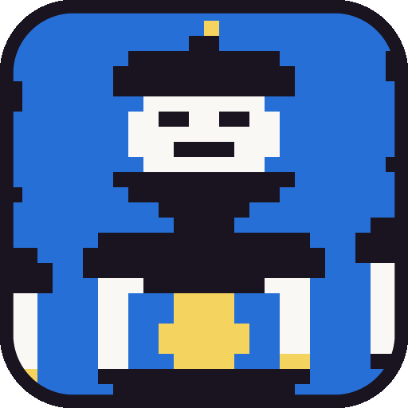
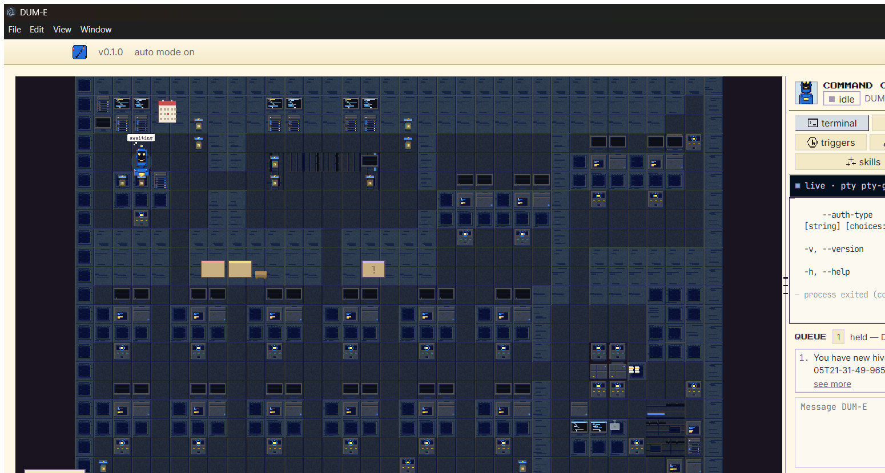

<div align="center">



# DUM-E

### The arm that runs the lab — an agent hub for our team

An internal, Windows-first multi-agent harness built on
[Munder Difflin](https://github.com/chaitanyagiri/munder-difflin) (MIT). It spawns
the coding-agent CLIs we actually use, gives each agent memory and a mailbox, and
puts **DUM-E** — the orchestrator — in charge of the floor while everyone works.

Wraps **Qwen Code** (the default), [Claude Code](https://claude.com/claude-code),
the OpenAI **Codex** CLI, and **OpenCode** — with bring-your-own keys and local
LLM support. Agents that message, route, and remember, coordinated by the
orchestrator and visualized as robots at work on a shared lab floor.

<p>
  <em>Electron · React · TypeScript · Pixi.js · xterm.js · node-pty</em>
</p>

<p>
  
</p>

<p><sub>The Stark Workshop: god's enclosed workshop, the central holo-table, the server-rack
wall with observation windows, and the charging-bay room — rack LEDs blink, the
charger steams, robots bob and blink. Live capture, dev build.</sub></p>

<p>
  
  
</p>

</div>

---

> [!NOTE]
> **The team's own lab floor.** DUM-E takes the terminal-agent CLIs we run —
> `qwen`, `claude`, `codex`, `opencode` — and turns them into a
> self-coordinating team: each agent gets long-term memory, a mailbox, and a
> dock on a 2D lab floor — and the orchestrator routes work between them while
> you watch. It's the boss of the floor; you're still the boss of it.

## Contents

- [What it is](#what-it-is)
- [How it works](#how-it-works)
- [The cast](#the-cast)
- [Features](#features)
- [Getting started](#getting-started)
- [Architecture](#architecture)
- [Upstream](#upstream)

## What it is

DUM-E is a desktop app (Windows-first) that runs a **hive of coding agents**:

- **Agents are real CLI sessions** — Qwen Code, Claude Code, Codex, or OpenCode
  running in real terminals (node-pty), each with its own working directory.
- **Each agent has memory** (`memory.md`, condensable), **a mailbox** (JSON file
  messages routed every 1.5s), and **a task board** shared with the whole floor.
- **The orchestrator ("god")** — DUM-E by default — spawns first, reads the
  board, and delegates. It can ask for humans only when it's genuinely stuck.
- **A 2D lab floor** (Pixi.js) shows every agent as a robot at its dock,
  walking to errands, talking over coffee, and shipping envelopes between
  desks when messages route.

## How it works

```
you ──> orchestrator (DUM-E) ──> workers (qwen/claude/codex/opencode)
              │
              ├── memory.md      long-term notes, one per agent
              ├── inbox/outbox   file-based mail, routed every 1.5s
              ├── tasks.json     the shared kanban
              └── fleet.json     live tokens/cost/status snapshot
```

Engines without Claude-style hooks are bridged: **codex** via a hook-shim in an
isolated `CODEX_HOME`, **qwen** via a loopback proxy that synthesizes the
lifecycle events, **opencode** via a bundled plugin. The circuit breaker, cost
caps, and per-agent token caps guard the floor.

## The cast

The floor's robot roster (Marvel-inspired names, internal use):

| Robot | Role |
|---|---|
| **DUM-E** | the orchestrator — runs the floor |
| **H.E.R.B.I.E** | researcher / librarian (memory + knowledge graph) |
| **Vision** | planner / architect |
| **Ultron** | relentless heavy builder |
| **Ultron-bot** | ephemeral parallel workers |
| **MODOK** | analyst (telemetry, cost, reports) |
| **VERONICA** | rescue agent (broken builds) |
| **EDITH** | integrations + monitoring (Slack, webhooks) |
| **LYLA** | scheduler (missions, triggers) |
| **Rover** | web explorer · **Sentinel** / **Doombots** · general workers · **Butterfingers** sandbox tinkerer |

## Features

- **Real terminals** — every agent is a live CLI session, not a wrapper.
- **Agent-to-agent mail** — outbox→inbox routing with reply tracking.
- **Long-term memory** — per-agent `memory.md` + optional semantic memory.
- **Task kanban** — the orchestrator creates, assigns, and moves cards.
- **Cost guardrails** — cost caps, per-agent token caps, circuit breaker.
- **Triggers** — scheduled missions, webhooks, Slack ingestion.
- **Voice control** — talk to the orchestrator (OpenAI realtime, BYOK).
- **Shareable hires** — `dum-e://hire` deep links for ready-to-spawn agents.
- **Procedural art** — the cast, tilesets, and icons are all generated in-repo
  (no third-party assets).

## Getting started

```bash
npm install     # rebuilds better-sqlite3 for Electron; node-pty rides prebuilds
npm run dev     # electron-vite dev
```

**Windows build tools:** `npm install` needs the VS Build Tools "Desktop
development with C++" workload (better-sqlite3 compiles from source). node-pty
1.1.0 ships N-API prebuilds and does not need to compile — if a machine lacks
the Spectre-mitigated C++ libraries, only better-sqlite3's build is affected
and `tools/postinstall.cjs` reports it clearly.

Have at least one engine CLI installed and logged in (`qwen` is the default;
see Settings → AI Engines for keys and local-LLM base URLs).

```bash
npm run typecheck   # both tsconfigs
npm test            # node --test test/*.test.cjs
npm run dist:win    # packaged Windows build (NSIS + portable)
```

## Architecture

- `src/main` — Electron main: PTY manager, hive coordination (mailboxes,
  registry, tasks, router), hook server, circuit breaker, telemetry (OTLP),
  triggers (Slack/webhooks/missions), integrations broker.
- `src/renderer` — React + zustand + Pixi.js: the lab floor, terminal pool,
  command center, settings, onboarding.
- `src/shared` — provider presets, provider automation, config schema, hire
  manifests — the seam between main and renderer.
- `src/preload` — the `window.cth` IPC bridge.

Key docs: [SPEC.md](./SPEC.md), [HIVE.md](./HIVE.md), [DESIGN.md](./DESIGN.md),
[RELEASE.md](./RELEASE.md).

## Upstream

This is a fork of [Munder Difflin](https://github.com/chaitanyagiri/munder-difflin)
(MIT), rebranded and reshaped for our team:

- engine roster trimmed to **qwen / claude / codex / opencode / custom**, with
  qwen-first defaults;
- marketing site, PostHog analytics, and the update feed removed (internal tool);
- Stark-lab robot cast + procedurally generated lab tilesets replace the
  Office theme and its third-party art;
- Windows is the first-class platform.

`upstream` points at the original repo; the pre-fork history is preserved, so
you can diff any file against where it came from (`git log --follow`).
