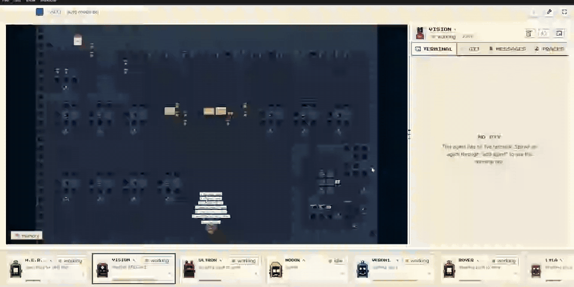
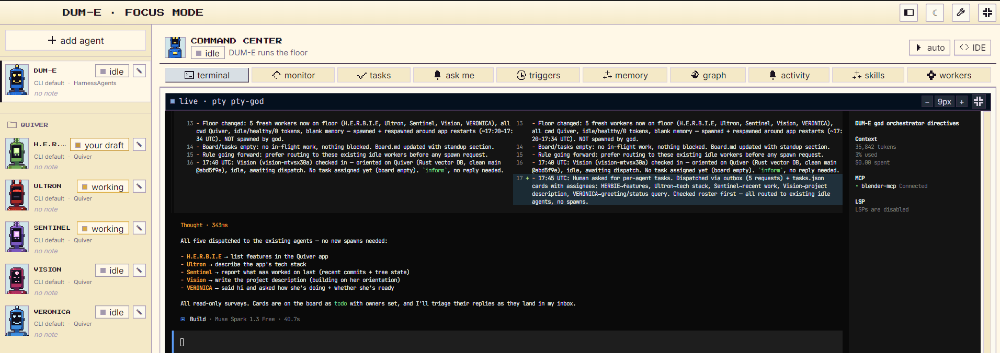
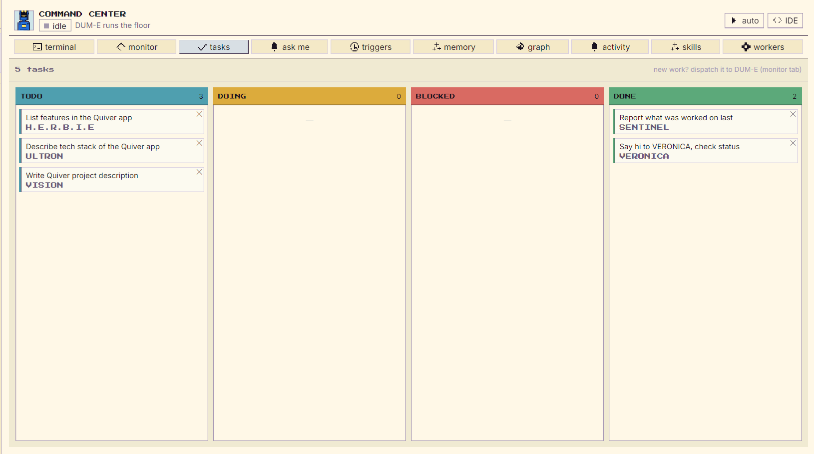
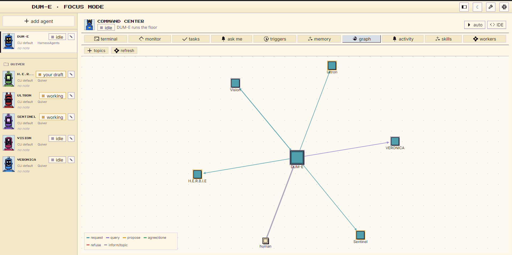
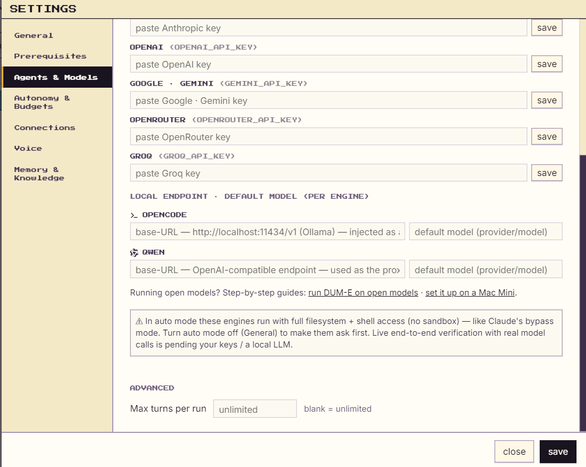

<div align="center">


# DUM-E

**A local-first desktop orchestrator for AI coding agents.**

Run OpenCode, Qwen Code, Claude Code, and Codex side by side as one coordinated team —
with shared memory, agent-to-agent messaging, a task board, and a live pixel-art
workshop floor where you can watch them work.

<p>
  <a href="https://github.com/uppalasrichaitanya/DUM-E-site/releases/latest"></a>
  <a href="https://github.com/uppalasrichaitanya/DUM-E/actions/workflows/ci.yml"></a>
  <a href="./LICENSE"></a>
  
</p>

<p>
  <a href="https://dum-e-lab.com"><b>Website</b></a> ·
  <a href="https://github.com/uppalasrichaitanya/DUM-E-site/releases/latest"><b>Download</b></a> ·
  <a href="#quick-start"><b>Quick start</b></a> ·
  <a href="#documentation"><b>Docs</b></a>
</p>



</div>

---

## Why DUM-E

Coding-agent CLIs are powerful on their own, but running several of them at once
turns into a mess of terminal tabs, copy-pasted context, and no idea who is doing
what. DUM-E turns them into a team:

- **One orchestrator, many workers.** DUM-E (the orchestrator) reads the board,
  breaks work down, and delegates to worker agents — you stay in charge of it.
- **Real terminals, not wrappers.** Every agent is a genuine CLI session in its own
  PTY, so each engine keeps its full native feature set.
- **Engine-agnostic.** Mix OpenCode, Qwen Code, Claude Code, and Codex on the same
  floor, with your own API keys or a local LLM.
- **You can see it.** Every agent is a robot on a 2D workshop floor — walking to
  errands, carrying mail between desks, and showing live status.

## Features

| | |
|---|---|
| 🖥️ **Live terminals** | Each agent runs in a real PTY (node-pty + xterm.js) with its own working directory. |
| ✉️ **Agent-to-agent mail** | Outbox → inbox routing with reply tracking; the orchestrator triages replies as they land. |
| 🧠 **Long-term memory** | Per-agent `memory.md` (condensable), optional semantic memory, and a shared knowledge graph. |
| 📋 **Task board** | A shared kanban the orchestrator creates, assigns, and moves cards on. |
| 🌳 **Git worktree isolation** | Optionally give each worker its own git worktree so parallel edits never collide. |
| 🛡️ **Cost guardrails** | Cost caps, per-agent token caps, max-turn limits, and a circuit breaker that trips on runaway loops. |
| ⏰ **Triggers** | Scheduled missions, webhooks, and Slack ingestion to start work without you. |
| 🎙️ **Voice** | Talk to the orchestrator in real time, or dictate into the queue (opt-in, bring your own key). |
| 🔗 **Shareable hires** | `dum-e://hire` deep links that spawn a ready-configured agent in one click. |
| 🧩 **Built-in IDE & git view** | Monaco editor, commit graph, and diff view without leaving the app. |
| 🌐 **Localized** | English, Arabic (RTL), and Simplified Chinese. |
| 🔒 **Local-first** | No telemetry, no account. Your keys and code stay on your machine. |

## Quick start

1. **Download** the latest build from the
   [releases page](https://github.com/uppalasrichaitanya/DUM-E-site/releases/latest):

   | Platform | File | Notes |
   |---|---|---|
   | Windows 10+ (x64) | `DUM-E-<version>-win-x64-setup.exe` | Per-user installer, no admin needed. Registers `dum-e://` links. |
   | Windows 10+ (x64) | `DUM-E-<version>-win-x64-portable.exe` | Single file, no install. |
   | Linux (x64) | `DUM-E-<version>-linux-x86_64.AppImage` | Coming soon. |

   > Builds are currently **unsigned**. On first launch, Windows SmartScreen will
   > show *"Windows protected your PC"* — click **More info → Run anyway**.

2. **Launch DUM-E.** The onboarding wizard checks prerequisites and installs Node.js
   and any missing agent CLI for you.

3. **Pick an engine and connect it.** Log in to the CLI, or paste an API key /
   local-LLM endpoint under **Settings → Agents & Models**.

4. **Give DUM-E a mission.** Type into the Command Center — the orchestrator plans
   the work, spawns or reuses workers, and posts cards to the task board.

## Supported engines

| Engine | Install (DUM-E can do this for you) | How DUM-E integrates |
|---|---|---|
| **OpenCode** *(default)* | `npm install -g opencode-ai@latest` | Bundled plugin emits lifecycle events |
| **Qwen Code** | `npm install -g @qwen-code/qwen-code@latest` | Loopback proxy synthesizes lifecycle events |
| **Claude Code** | `npm install -g @anthropic-ai/claude-code` | Native hooks |
| **Codex** | `npm install -g @openai/codex` | Hook shim in an isolated `CODEX_HOME` (your global config is never touched) |

Local models work through any OpenAI-compatible endpoint (for example Ollama at
`http://localhost:11434/v1`).

## Screenshots

<table>
  <tr>
    <td width="50%"><br><sub><b>Command Center</b> — the orchestrator's live terminal and dispatch log</sub></td>
    <td width="50%"><br><sub><b>Task board</b> — cards created and assigned by the orchestrator</sub></td>
  </tr>
  <tr>
    <td width="50%"><br><sub><b>Message graph</b> — who asked whom, and what</sub></td>
    <td width="50%"><br><sub><b>Engines & keys</b> — bring your own key or a local LLM</sub></td>
  </tr>
</table>

## How it works

```
 you ──► DUM-E (orchestrator) ──► workers: opencode · qwen · claude · codex
              │
              ├── memory.md    long-term notes, one per agent
              ├── inbox/outbox file-based mail, routed every 1.5 s
              ├── tasks.json   the shared kanban
              └── fleet.json   live tokens / cost / status snapshot
```

Each agent is spawned in a PTY with an injected protocol prompt that tells it who it
is, who else is on the floor, and how to read its inbox. A local hook server
receives lifecycle events (turn start/stop, tool use, notifications) from every
engine, normalizes them, and drives agent status, inbox draining, cost tracking,
and the floor animation. Engines without Claude-style hooks are bridged by a shim,
plugin, or proxy so they all behave the same to the orchestrator.

## The cast

Every agent on the floor is a robot with its own silhouette and role:

| Robot | Role |
|---|---|
| **DUM-E** | Orchestrator — runs the floor |
| **H.E.R.B.I.E** | Researcher / librarian (memory + knowledge graph) |
| **Vision** | Planner / architect |
| **Ultron** | Heavy builder |
| **Ultron-bot** | Ephemeral parallel workers |
| **MODOK** | Analyst — telemetry, cost, reports |
| **VERONICA** | Rescue — fixes broken builds |
| **EDITH** | Integrations and monitoring (Slack, webhooks) |
| **LYLA** | Scheduler — missions and triggers |
| **Rover** · **Sentinel** · **Doombots** · **Butterfingers** | Web explorer, general workers, sandbox tinkerer |

## Build from source

**Requirements:** Node.js 20+, Git, and on Windows the Visual Studio Build Tools
*"Desktop development with C++"* workload (needed to compile `better-sqlite3`).

```bash
git clone https://github.com/uppalasrichaitanya/DUM-E.git
cd DUM-E
npm install          # rebuilds better-sqlite3 for Electron; node-pty uses prebuilds
npm run dev          # start the app with hot reload
```

| Command | What it does |
|---|---|
| `npm run dev` | Run the app in development mode |
| `npm run typecheck` | Type-check main and renderer |
| `npm test` | Run the test suite (`node --test`, 640+ tests) |
| `npm run dist:win` | Package the Windows installer + portable exe |
| `npm run dist:linux` | Package the Linux AppImage |

Tagging a `v*` release runs [`.github/workflows/release.yml`](./.github/workflows/release.yml),
which builds Windows and Linux artifacts with SHA-256 checksums.

## Architecture

**Stack:** Electron · React · TypeScript · Zustand · Pixi.js · xterm.js · node-pty · better-sqlite3

```
src/
├── main/       Electron main process: PTY manager, hive coordination (mailboxes,
│               registry, tasks, router), hook server, circuit breaker, git/worktrees,
│               triggers (Slack, webhooks, missions), MCP wiring
├── renderer/   React UI: workshop floor (Pixi.js), terminal pool, Command Center,
│               IDE, settings, onboarding
├── shared/     Engine presets, config schema, hire manifests — the main/renderer seam
└── preload/    The typed IPC bridge exposed to the renderer
```

### Engineering highlights

- **Windows launcher decoding.** npm and Qwen Code install CLIs behind `.cmd`
  launchers that `cmd.exe` mangles (multi-line prompts get cut at the first newline).
  DUM-E parses those launchers and spawns the real `node` / `.exe` target directly,
  so the full protocol prompt arrives intact.
- **Engine bridging.** Four CLIs with four different lifecycle models are normalized
  into one event contract via native hooks, a hook shim, a plugin, and a loopback
  proxy.
- **Procedural art.** The robots, tilesets, icons, and logo are all generated by code
  in this repo, following a written art bible
  ([docs/ART-TECHNIQUES.md](./docs/ART-TECHNIQUES.md)). The workshop map is produced by a
  generator that uses BFS to prove every desk and errand spot is reachable before
  the map is written.
- **Tested.** 640+ `node --test` tests cover the hive protocol, the circuit breaker,
  cost accounting, launcher parsing, i18n, and more.

## Documentation

| Doc | About |
|---|---|
| [SPEC.md](./SPEC.md) | Product spec |
| [HIVE.md](./HIVE.md) | Multi-agent protocol: mail, tasks, roster |
| [MEMORY_GRAPH_SPEC.md](./MEMORY_GRAPH_SPEC.md) | Memory and knowledge graph |
| [DESIGN.md](./DESIGN.md) | UI and brand system |
| [docs/message-queue.md](./docs/message-queue.md) | Message queue contract |
| [docs/MISSION-LOG.md](./docs/MISSION-LOG.md) | Log of the first real mission |
| [CHANGELOG.md](./CHANGELOG.md) | Release history |

## Roadmap

- [ ] Verified Linux AppImage release
- [ ] Re-enable in-app auto-update
- [ ] Code-signed Windows builds
- [ ] winget / Scoop packages
- [ ] macOS build

## Contributing

Issues and pull requests are welcome — see [CONTRIBUTING.md](./CONTRIBUTING.md) and
the [Code of Conduct](./CODE_OF_CONDUCT.md). To report a security problem, follow
[SECURITY.md](./SECURITY.md).

## License

[MIT](./LICENSE) © Sri Chaitanya Uppala
